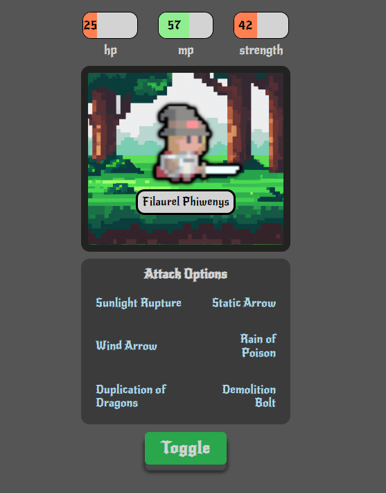
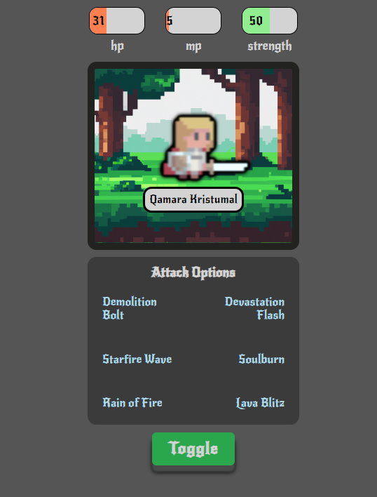
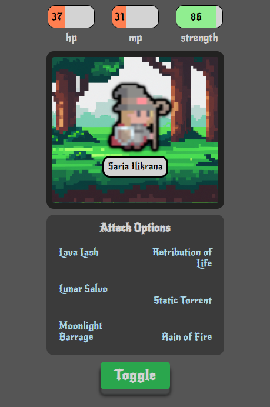

# 🥷 War Game

> A very simple computer game which you can just toggle and appears lots of characters.

**_1. By Clicking Toggle you can change different kinds of characters_**

**_2. By changing characters the names and all other appearances also change_**







---

Warning: Vite enforces using jsx syntax inside jsx/tsx files, so it will complain about that. Solution: rename `.js` files to `.jsx` :)

Quick start:

```
$ npm install
$ npm run dev
$ npm start

```

```
$ pnpm install
$ pnpm run dev
$ pnpm start

```

Head over to https://vitejs.dev/ to learn more about using vite


## Languages and Tools are used

1. **Languages**
    + [HTML](https://github.com/topics/html)
    + [HTML5](https://github.com/topics/html5)
    + [CSS](https://github.com/topics/css)
    + [CSS3](https://github.com/topics/css3)
    + [React](https://github.com/topics/react)
    + [JavaScript](https://github.com/topics/javascript)

2. **Tools** 
